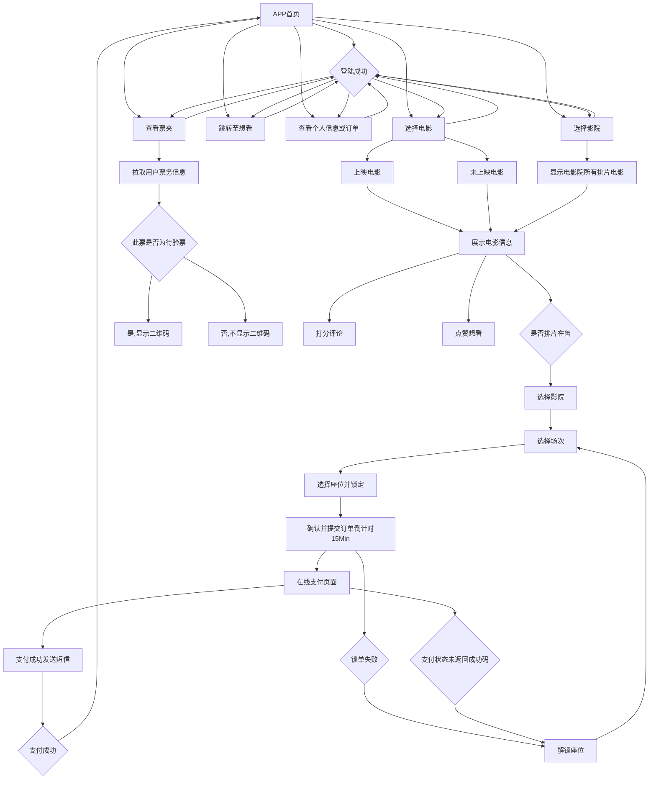

# 项目简介

XJCO2913软件工程开发课程项目，电影订票系统前端。

Node后端api,前端Vue的电影订票系统。可以完全前后分离使用，前端可编译后使用cordora或HbuilderX打包成apk或ipa在安卓或ios上使用，亦可托管静态文件至nginx实现网页端界面，这里是前端项目库，整体设计介乎淘票票和美团电影模块之间。

#  主要功能（前端）

### 功能概述

1. 多城市多影院的电影订票选择。

2. 用户登陆（包括手机验证码登陆和密码登陆），拉去个人信息，包括评论，喜欢的电影，推荐电影信息，票务信息等。

3. 不同影厅内选座，购票，支付流程。

4. 评论及打分系统。

5. 二维码检票。

6. 订单管理，显示个人用户订单，并在前端可操作退票等。

### 交互逻辑

